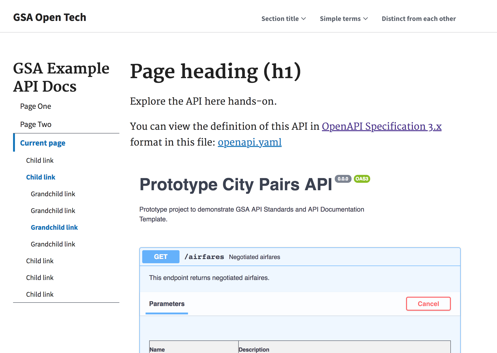

# GSA API Documentation Template - accessible and using USWDS

This is an updated version of the GSA API Documentation template. It has the following improvements:
- Tested for [Section 508 accessbility](https://section508.gov/)
- Uses [U.S. Web Design System](https://designsystem.digital.gov/)
- Uses [Open API Specification (OAS) 3.0](https://github.com/OAI/OpenAPI-Specification)

## Dependencies
- Swagger UI v 3.18.3 (with customizations) - https://github.com/swagger-api/swagger-ui/tree/v3.18.3
- USWDS 1.6.8 - https://designsystem.digital.gov/download/

## Customization
- For section 508 accessibility, edits have been made directly to the minified [swagger-ui-bundle.js](swagger-ui-bundle.js) file. This is a workaround, but the be situation would be for those changes to be implemented in the SwaggerUI.

## Running locally  

Because this uses HTML and JavaScript, the files can be opened locally in the browser. However, to run the Swagger UI on page 3, it will need to be run on a web server.

An example of a simple local web server on a Mac is to run the following command in the root directory:

`python -m http.server`